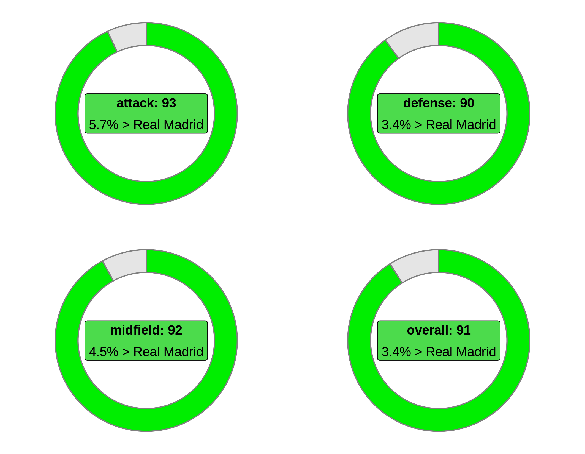

# FIFA 20 - finding the Dream Team

This repository contains the codes of the post [Determinando o Dream Team do FIFA 20 utilizando programação linear](https://nagahamavh.github.io/posts/dream-team-fifa20/) published in my blog.

The goal of the analysis is to find the Dream Team using Linear Programming methodology.

***

## Setup

1. Clone this repository
2. Install the solver [SYMPHONY](https://projects.coin-or.org/SYMPHONY) (it's also possible to use other solver)
3. Install the packages (I recommend to use a virtual environment)
    - Install `renv` package
    - Set the working directory in the root folder of the repo
    - Run in `R` the command `renv::init()` to install all the necessary packages
